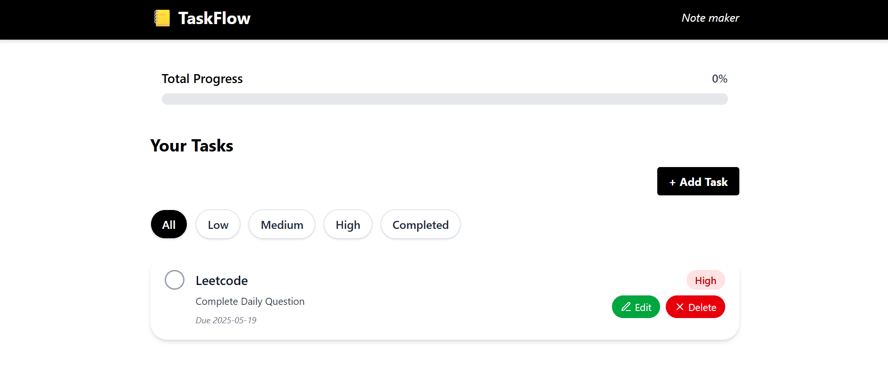

# TaskFlow 📝 – Task Manager Web App

**TaskFlow** is a sleek and intuitive task management web application built using **React**, **Vite**, and **Tailwind CSS**. It offers a complete CRUD experience using `localStorage`, ensuring your tasks are saved even after closing the browser — with no backend required.


## 🔥 Features

- ✅ **Create, Read, Update, and Delete (CRUD)** tasks
- 🧠 **Priority filtering**: View tasks by **Low**, **Medium**, or **High** priority
- ✔️ **Completion tracking** with progress bar
- 📂 **Filter by completion status**: Show only **Completed** or **All** tasks
- 💾 **Persistent storage** with `localStorage`
- 🖥️ **Responsive & minimal UI** built with Tailwind CSS
- ⚡ **Super fast** with Vite development setup


## 🖼️ UI Preview

> Below is a preview of the task management interface, including the progress bar and filtering buttons:




## Live Demo 
[https://task-flow-one-tau.vercel.app/](https://task-flow-one-tau.vercel.app/)


## 🛠 Tech Stack

| Technology     | Purpose                         |
|----------------|---------------------------------|
| React          | Frontend JavaScript framework   |
| Vite           | Next-generation frontend tooling |
| Tailwind CSS   | Utility-first CSS styling       |
| localStorage   | Browser-based task persistence  |


## 🚀 Getting Started

#### 1. Clone the Repository

```bash
git clone https://github.com/sandeep-m-patil/TaskFlow.git
cd TaskFlow
```

#### 2.  Install Dependencies
```bash
npm install
```

#### Start the App
```bash
npm run dev
```

#### Open your browser and navigate to http://localhost:5173.

